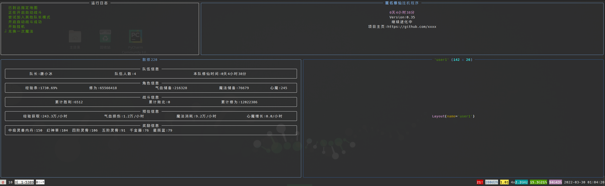
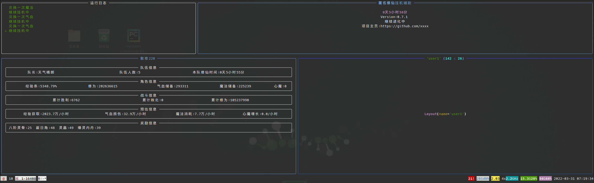

## 简介

匿名修仙挂机辅助工具，主要功能是断线重连，显示挂机情况







### 已完成功能

- [x] 自动挂机

    - [x] 断线重连
    - [x] 指定队长加入（暂时没处理密码问题）
    - [x] 随机加入未加密队伍
    - [x] 自己组队

- [x] 采药任务

- [x] 寻宝任务

- [ ] 多用户

## 运行环境

首先需要创建一个Python环境，我使用conda管理包系统，你也可以使用pip

### conda

1. 安装 我是安装的miniconda,Anaconda太重，安装流程就不过多介绍了，可以去[清华大学镜像](https://mirrors.tuna.tsinghua.edu.cn/anaconda/miniconda/)找到最新的安装包下载下来
   安装好后需要为conda添加频道

   ```bash
   conda config --add channels conda-forge
   conda config --add channels microsoft
   ```

2. 创建环境 用conda创建一个名为`niming`的环境，名字可以在下方文件里修改

   ```bash
   conda env create -f environment.yml
   ```

3. 安装chromium浏览器 因为使用了playwright包，所以需要使用命令行为他安装对应的浏览器 如果你是Debian系的系统，可以使用下面的命令一并安装浏览器和依赖
   ```bash
   playwright install --with-deps chromium
   ```
   如果是其他系统，就使用安装，但是两种命令都有可能遇到缺少依赖问题
      ```bash
   playwright install chromium
   ```

### pip

pip创建环境可以用virtualenv等创建环境，用提供的requirements.txt安装依赖，
其他的参考上边或看看playwright的文档，[文档1](https://playwright.dev/python/docs/intro) [文档2](https://playwright.dev/python/docs/cli#install-system-dependencies)

### 启动

本脚本的最终目的就是在服务器上挂机，随时随地能够查看，所以使用了byobu这样支持后台的终端，你也可以使用原生的tmux或screen

```bash
byobu
cd /opt/NiMing
conda activate niming
python main.py
```

## 配置说明

编辑`config.yml`文件或者将`config-example.yml`改名

目前由于还不支持多用户，所以暂时只需要配置第一个用户，可以参考`config-example.yml`文件

配置有优先级，如果配置了任务，就优先做任务，如果配置了队长则优先加入其他人队伍，如果想自己挂机，就在队长那里留空，并且设置`alone`为`True`


